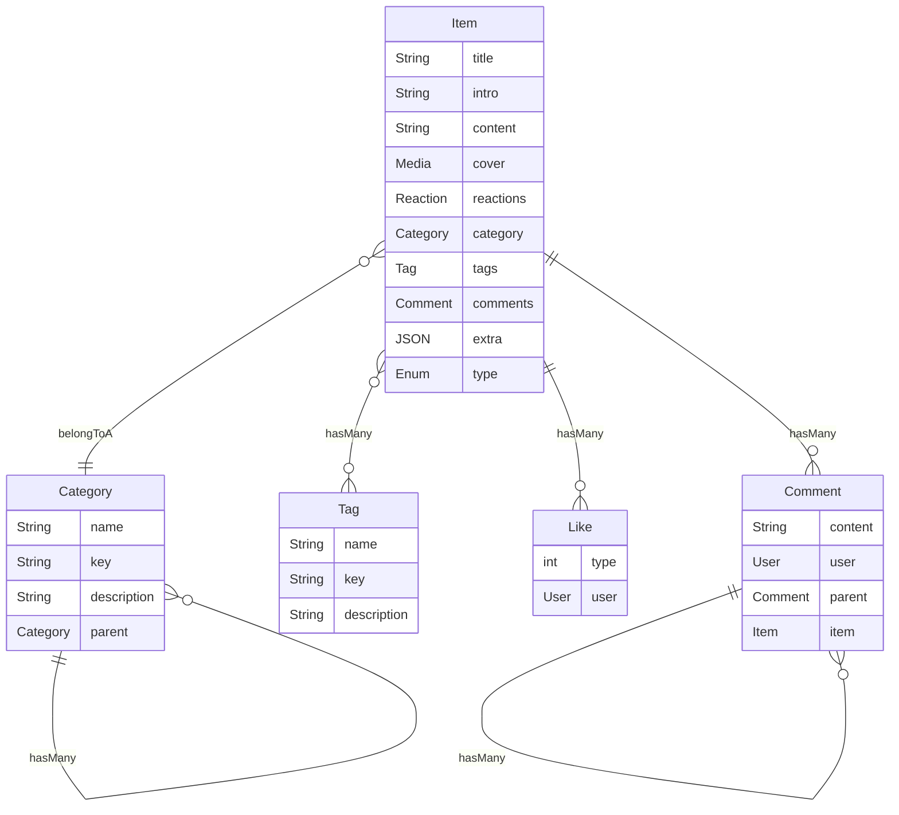

# CMS API

CMS API

```mermaid
erDiagram
  Item o{--|| Category : belongToA
  Item o{--o{ Tag: hasMany
  Item ||--o{ Like: hasMany
  Item ||--o{ Comment: hasMany
  Comment ||--o{ Comment: hasMany
  Category ||--o{ Category: hasMany

  Item {
    String title
    String intro
    String content
    Media cover
    Reaction reactions
    Category category
    Tag tags
    Comment comments
    JSON extra
    Enum type
  }

  Category {
    String name
    String key
    String description
    Category parent
  }

  Tag {
    String name
    String key
    String description
  }

  Like {
    int type
    User user
  }

  Comment {
    String content
    User user
    Comment parent
    Item item
  }
```

## Comment
Root comment should have an itemId