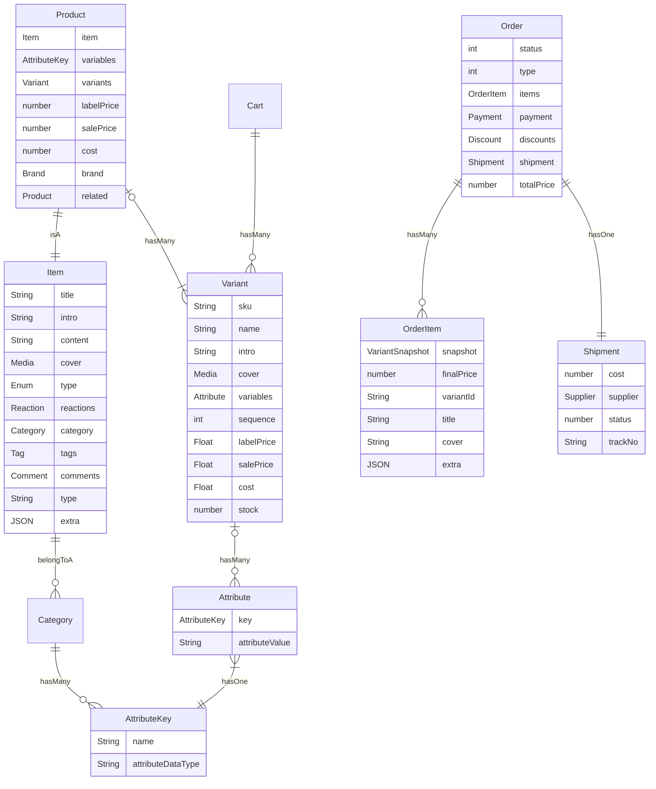

# Commodity API

Commodity API

```mermaid
erDiagram
  Product ||--||  Item : isA
  Product |o--|{ Variant: hasMany
  Variant |o--o{ Attribute: hasMany
  Attribute }|--|| AttributeKey: hasOne
  Item ||--o{ Category: belongToA
  Category ||--o{ AttributeKey: hasMany

  Cart ||--o{ Variant: hasMany

  Order ||--o{ OrderItem: hasMany
  Order ||--|| Shipment: hasOne

  Item {
    String title
    String intro
    String content
    Media cover
    Enum type
    Reaction reactions
    Category category
    Tag tags
    Comment comments
    String type
    JSON extra
  }

  Attribute {
    AttributeKey key
    String attributeValue
  }

  AttributeKey {
    String name
    String attributeDataType
  }

  Product {
    Item item
    AttributeKey variables
    Variant variants
    number labelPrice
    number salePrice
    number cost
    Brand brand
    Product related
  }

  Variant {
    String sku
    String name
    String intro
    Media cover
    Attribute variables
    int sequence
    Float labelPrice
    Float salePrice
    Float cost
    number stock
  }
  
  OrderItem {
    VariantSnapshot snapshot
    number finalPrice
    String variantId
    String title
    String cover
    JSON extra
  }

  Order {
    int status
    int type
    OrderItem items
    Payment payment
    Discount discounts
    Shipment shipment
    number totalPrice
  }

  Shipment {
    number cost
    Supplier supplier
    number status
    String trackNo
  }
```
